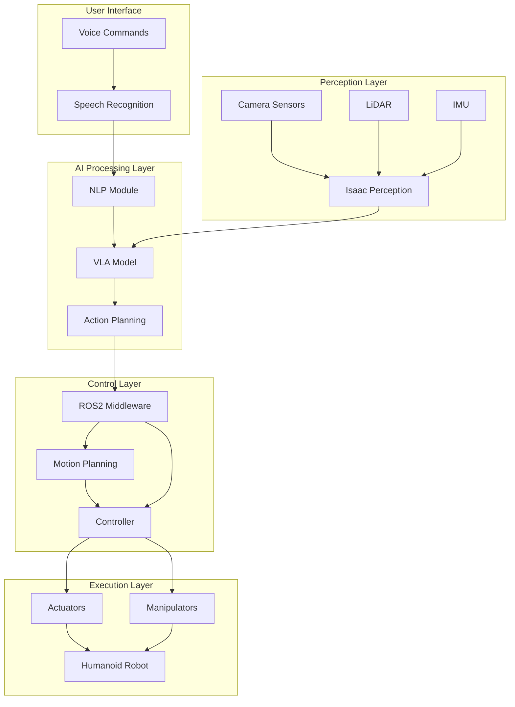

# System Architecture

## Overview

The humanoid Voice-to-Action (VTA) robot system is a complex integration of multiple robotic frameworks and AI components. This architecture combines ROS2 for communication and orchestration, NVIDIA Isaac for perception and control, Gazebo for simulation, and VLA models for intelligent decision-making.

## High-Level System Diagram

## ROS2 Communication Architecture

The ROS2 graph consists of multiple nodes communicating through topics, services, and actions:

### Core Nodes

- **voice_command_node**: Processes voice input and converts to semantic commands
- **perception_node**: Handles sensor data processing and environment understanding
- **vta_planning_node**: Integrates vision, language, and action for decision making
- **motion_planning_node**: Generates trajectories for robot movement
- **controller_node**: Low-level control of robot actuators
- **simulation_bridge_node**: Interfaces between real robot and Gazebo simulation

### Key Topics

- `/voice_commands` - Voice commands from speech recognition
- `/perception/objects` - Detected objects and their poses
- `/perception/scene` - Scene understanding and segmentation
- `/vta/action_plan` - Planned actions from VLA model
- `/motion/trajectory` - Motion trajectories for execution
- `/robot/joint_states` - Current robot joint positions
- `/robot/cmd_vel` - Velocity commands for navigation

### Key Services

- `/vta/query` - Query the VLA model for action recommendations
- `/motion/plan_path` - Request motion planning for navigation
- `/control/execute_action` - Execute specific robot actions

### Key Actions

- `/manipulation/pick_place` - Pick and place operations
- `/navigation/move_to` - Navigation goals
- `/vta/execute_task` - High-level task execution

## Compute Layout

### Workstation Configuration

The primary compute unit runs the AI processing and orchestration:

- **CPU**: 16+ cores for parallel processing
- **GPU**: NVIDIA RTX 4090 or equivalent for VLA model inference
- **RAM**: 64GB+ for handling large models and sensor data
- **Storage**: High-speed NVMe SSD for model loading

### Edge Computing (Optional)

For real-time control and safety:

- **Robot Controller**: Real-time capable system for low-level control
- **Safety Monitor**: Hardware-based safety system
- **Communication Module**: Low-latency communication with workstation

## Data Flow Architecture

### Input Data Flow

1. **Sensor Data Collection**
   - Camera streams (RGB, depth) at 30Hz
   - LiDAR point clouds at 10Hz
   - IMU data at 100Hz
   - Microphone audio at 16kHz

2. **Perception Processing**
   - Object detection and classification
   - Scene understanding and segmentation
   - Pose estimation for manipulable objects
   - Environment mapping

3. **VLA Integration**
   - Natural language processing of voice commands
   - Vision-language fusion for context understanding
   - Action planning based on current state
   - Safety constraint validation

4. **Motion Planning**
   - Path planning for navigation
   - Trajectory generation for manipulation
   - Collision avoidance
   - Kinematic constraint satisfaction

5. **Control Execution**
   - Low-level trajectory following
   - Joint position/velocity control
   - Force control for manipulation
   - Safety monitoring

### Feedback Loop

The system operates in a continuous loop with multiple feedback paths:

- Perception continuously updates world state
- Control execution provides joint feedback
- VLA model adapts based on execution results
- Safety systems can interrupt execution

## Safety Architecture

### Safety Layers

1. **Hardware Safety**: Emergency stops, physical limits
2. **Software Safety**: Collision detection, velocity limits
3. **AI Safety**: Action validation, ethical constraints
4. **Communication Safety**: Fail-safe protocols

### Fail-Safe Mechanisms

- Autonomous stop on perception failures
- Graceful degradation on VLA model failures
- Safe position holding on communication losses
- Emergency stop procedures

## Performance Considerations

### Latency Requirements

- Perception: < 50ms for real-time operation
- VLA inference: < 200ms for responsive interaction
- Control loop: < 10ms for stable control
- Communication: < 10ms end-to-end

### Throughput Requirements

- Sensor data: 100+ MB/s for high-resolution inputs
- Model inference: Sustained GPU utilization
- ROS2 communication: 1000+ messages/second
- Storage I/O: Fast model loading and data logging

## Scalability Considerations

The architecture is designed to scale from simulation to real hardware:

- Simulation-first development and testing
- Modular components for easy replacement
- Hardware abstraction layers
- Configurable performance parameters