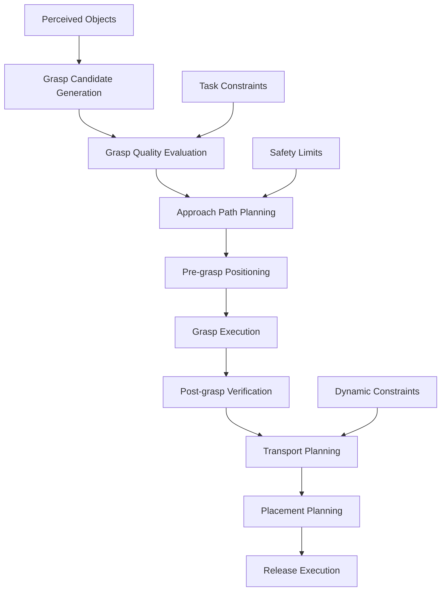

# Manipulation System

## Overview

The manipulation system enables the humanoid robot to interact with objects in its environment through precise control of arms, hands, and other manipulators. This system integrates motion planning, inverse kinematics, and control algorithms to execute complex manipulation tasks safely and efficiently. The system interfaces with the perception layer to identify graspable objects and with the VLA model to interpret manipulation commands from voice instructions.

## Manipulator Architecture

### Hardware Configuration

#### Arm Specifications
- **Degrees of Freedom**: 7-DOF for each arm (shoulder, elbow, wrist)
- **Reach**: 1.2m from torso center (typical humanoid)
- **Payload**: 2-5kg depending on reach and configuration
- **End Effectors**: Multi-fingered hands or configurable grippers
- **Actuator Type**: Servo motors with position/velocity/effort control

#### Hand/End Effector Design
- **Fingers**: 3-5 dexterous fingers with tactile sensing
- **Joints**: Multiple joints per finger for complex grasps
- **Tactile Sensors**: Force/torque and contact detection
- **Grasp Types**: Precision, power, and intermediate grasps

### Control Architecture

#### Hierarchical Control Structure
1. **High-Level Planner**: Task-level manipulation planning
2. **Trajectory Generator**: Smooth motion trajectories
3. **Inverse Kinematics**: Joint space conversion
4. **Low-Level Controller**: Joint position/velocity control
5. **Safety Monitor**: Collision avoidance and force limits

## Motion Planning

### Cartesian Motion Planning

#### Path Planning Algorithms
- **RRT* (Rapidly-exploring Random Trees)**: For high-dimensional spaces
- **CHOMP (Covariant Hamiltonian Optimization)**: For smooth trajectories
- **STOMP (Stochastic Trajectory Optimization)**: For obstacle avoidance
- **TrajOpt**: Sequential convex optimization for trajectory planning

#### Planning Considerations
- **Kinematic Constraints**: Joint limits, velocity limits
- **Dynamic Constraints**: Acceleration and jerk limits
- **Collision Avoidance**: Self-collision and environment collision
- **Singularity Avoidance**: Prevent kinematic singularities

### Grasp Planning

#### Grasp Candidate Generation
- **Geometric Analysis**: Analyze object shape and size
- **Physical Properties**: Consider weight, friction, center of mass
- **Accessibility**: Ensure grasp points are reachable
- **Stability**: Evaluate grasp stability under perturbations

#### Grasp Evaluation Metrics
- **Grasp Quality**: Measure of grasp stability and robustness
- **Force Closure**: Ability to resist arbitrary forces/torques
- **Task Suitability**: Appropriateness for specific manipulation task
- **Approach Feasibility**: Reachable approach trajectory

### Manipulation Planning Pipeline

## Inverse Kinematics

### Analytical vs Numerical IK

#### Analytical Solutions
- **Advantages**: Fast, exact solutions for simple chains
- **Applications**: Simple serial manipulators
- **Limitations**: Not applicable to complex redundant chains

#### Numerical Methods
- **Jacobian-based**: Jacobian transpose, pseudoinverse
- **Cyclic Coordinate Descent (CCD)**: Iterative joint adjustments
- **Levenberg-Marquardt**: Robust numerical optimization
- **Task Space Region**: Handle redundancy and constraints

### Redundancy Resolution

For redundant manipulators (more DOF than task space dimensions):

- **Null Space Projection**: Optimize secondary objectives
- **Joint Limit Avoidance**: Maintain joints away from limits
- **Obstacle Avoidance**: Use null space for collision avoidance
- **Energy Minimization**: Optimize for power consumption

### Real-time IK Considerations

- **Computational Efficiency**: < 1ms for real-time applications
- **Convergence Guarantees**: Reliable solutions within time bounds
- **Smooth Transitions**: Continuous motion between targets
- **Singularity Handling**: Graceful behavior near singularities

## Control Systems

### Low-Level Controllers

#### PID Controllers
- **Position Control**: Standard PID for joint positioning
- **Velocity Control**: Feedforward for dynamic motions
- **Effort Control**: Force/torque control for compliant behavior

#### Advanced Control Techniques
- **Impedance Control**: Admittance behavior for safe interaction
- **Adaptive Control**: Compensate for changing dynamics
- **Robust Control**: Handle modeling uncertainties

### Safety Constraints

#### Force/Torque Limits
- **Joint Limits**: Maximum torques to prevent damage
- **End-effector Limits**: Force constraints for safe interaction
- **Rate Limits**: Velocity and acceleration constraints

#### Collision Avoidance
- **Proximity Monitoring**: Distance-based collision prediction
- **Emergency Stops**: Immediate halt on collision detection
- **Safe Recovery**: Predefined postures for collision recovery

### Compliance and Impedance Control

#### Variable Impedance
- **Stiffness Modulation**: Adjust stiffness based on task requirements
- **Damping Control**: Manage energy dissipation
- **Virtual Springs**: Create desired mechanical behavior

#### Contact Handling
- **Impact Mitigation**: Soft contact with environment
- **Slip Prevention**: Maintain grasp during contact
- **Force Regulation**: Control interaction forces

## Motion Execution

### Trajectory Generation

#### Smooth Motion Profiles
- **Minimum Jerk**: Smooth acceleration profiles
- **Trigonometric**: Cosine-based smooth transitions
- **Polynomial**: Higher-order polynomial interpolation
- **Time-optimal**: Fastest motion within constraints

#### Multi-segment Trajectories
- **Waypoint Following**: Sequence of intermediate positions
- **Blending**: Smooth transitions between segments
- **Velocity Continuity**: Maintain smooth velocity profiles
- **Timing Coordination**: Synchronize multiple joints

### Execution Monitoring

#### State Estimation
- **Joint State Feedback**: Position, velocity, effort readings
- **External Sensing**: Force/torque, tactile, vision feedback
- **Predictive Monitoring**: Anticipate execution deviations
- **Health Assessment**: Component status and performance

#### Adaptive Execution
- **Online Re-planning**: Adjust trajectory based on feedback
- **Speed Scaling**: Adjust execution speed based on safety
- **Force Compensation**: Adapt to environmental contacts
- **Recovery Procedures**: Handle execution failures gracefully

## Integration with VLA Models

### Voice Command Interpretation

#### Command Parsing
- **Action Recognition**: Identify manipulation verbs (grasp, lift, place)
- **Object Specification**: Map object names to perceived entities
- **Location Context**: Interpret spatial relationships (left, right, on table)
- **Sequence Understanding**: Parse multi-step manipulation tasks

#### Action Mapping
- **Primitive Actions**: Map high-level commands to basic primitives
- **Parameter Extraction**: Determine grasp types, placement locations
- **Constraint Application**: Apply task-specific constraints
- **Safety Verification**: Validate action feasibility and safety

### Perception Integration

#### Object Localization
- **Pose Tracking**: Maintain object pose estimates over time
- **Uncertainty Management**: Account for perception uncertainty
- **Multi-modal Fusion**: Combine vision, touch, and proprioception
- **Prediction**: Predict object motion and availability

#### Grasp Selection
- **Context-Aware Grasping**: Select appropriate grasp based on task
- **Adaptive Grasping**: Adjust grasp based on object properties
- **Verification**: Confirm successful grasp execution
- **Recovery**: Handle failed grasp attempts

## Safety Systems

### Physical Safety

#### Collision Detection
- **Self-Collision**: Prevent robot from colliding with itself
- **Environment Collision**: Avoid collisions with surroundings
- **Human Safety**: Maintain safe distances from humans
- **Soft Contacts**: Controlled interaction with environment

#### Force Limiting
- **Contact Forces**: Limit forces during interaction
- **Grasp Forces**: Control grip strength appropriately
- **Joint Torques**: Prevent excessive actuator loads
- **Emergency Stop**: Immediate halt on dangerous conditions

### Functional Safety

#### System Monitoring
- **Component Health**: Monitor controller and sensor status
- **Performance Degradation**: Detect and respond to declining performance
- **Communication Integrity**: Ensure reliable command execution
- **Redundant Systems**: Backup safety mechanisms

#### Fail-Safe Behaviors
- **Safe Poses**: Move to predefined safe configurations
- **Graceful Degradation**: Continue operation with reduced capability
- **Recovery Procedures**: Return to operational state safely
- **Human Intervention**: Allow manual override when needed

## Performance Optimization

### Computational Efficiency
- **Parallel Processing**: Utilize multi-core architectures
- **GPU Acceleration**: Offload computation to GPUs where possible
- **Approximate Methods**: Trade accuracy for speed when acceptable
- **Caching**: Store precomputed solutions when possible

### Energy Efficiency
- **Trajectory Optimization**: Minimize energy consumption
- **Idle State Management**: Reduce power during inactivity
- **Actuator Efficiency**: Optimize control for minimal energy use
- **Predictive Power Management**: Anticipate power requirements

### Accuracy and Precision
- **Calibration**: Maintain accurate kinematic and dynamic models
- **Feedback Control**: Use multiple feedback sources
- **Learning**: Adapt control parameters based on experience
- **Validation**: Regular accuracy assessment and adjustment