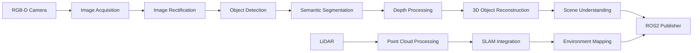

# Perception System

## Overview

The perception system forms the foundation of the humanoid robot's environmental awareness. It integrates multiple sensors and processing pipelines to enable the robot to understand its surroundings, detect objects of interest, and navigate safely. This system leverages NVIDIA Isaac ROS packages for efficient perception processing and integrates with the VLA model for higher-level scene understanding.

## Sensor Configuration

### Primary Sensors

#### RGB-D Cameras
- **Resolution**: 1920x1080 or higher
- **Frame Rate**: 30fps minimum
- **Depth Range**: 0.3m to 5m
- **Field of View**: 60° horizontal, 45° vertical
- **Mounting**: Head-mounted for human-like perspective
- **Stereo Configuration**: Dual cameras for enhanced depth estimation

#### LiDAR Sensors
- **Type**: 360° spinning LiDAR or solid-state
- **Range**: 10-25m effective range
- **Resolution**: 0.1° angular resolution
- **Points/Second**: 100,000+ points
- **Mounting**: Body-mounted for 360° coverage

#### Inertial Measurement Unit (IMU)
- **Accelerometer**: ±16g range
- **Gyroscope**: ±2000°/s range
- **Magnetometer**: For absolute orientation
- **Update Rate**: 100Hz minimum
- **Integration**: For sensor fusion and stabilization

#### Additional Sensors
- **Microphones**: Array for sound source localization
- **Force/Torque Sensors**: In manipulator joints
- **Joint Encoders**: For precise position feedback
- **Safety Bumpers**: Collision detection on robot body

## Camera Pipeline Architecture

### Isaac ROS Perception Stack

The perception pipeline utilizes NVIDIA Isaac ROS packages optimized for GPU acceleration:



### Image Acquisition and Preprocessing

The camera pipeline begins with image acquisition using the Isaac ROS Image Acquisition package:

```yaml
# camera_pipeline_config.yaml
camera:
  frame_rate: 30
  resolution: [1920, 1080]
  exposure_mode: "auto"
  gain: 1.0
  white_balance: "auto"

preprocessing:
  rectification: true
  undistortion: true
  normalization: true
  gpu_processing: true
```

### Object Detection Pipeline

The object detection pipeline uses Isaac ROS Detection3D package with pre-trained models:

1. **Input**: RGB and depth images
2. **Processing**:
   - 2D object detection using TensorRT acceleration
   - 3D bounding box estimation
   - Instance segmentation
3. **Output**: Object poses, confidence scores, and classifications

```python
# Example object detection node
import rclpy
from isaac_ros.object_detection import Detection3D, Detection3DArray

class PerceptionNode:
    def __init__(self):
        self.detection_subscriber = self.create_subscription(
            Detection3DArray,
            '/isaac_ros/detections',
            self.detection_callback,
            10
        )

    def detection_callback(self, msg):
        for detection in msg.detections:
            # Process 3D object pose
            object_pose = detection.pose
            object_class = detection.class_name
            confidence = detection.confidence
            # Integrate with VLA planning
```

### Semantic Segmentation

Semantic segmentation provides pixel-level understanding of the environment:

- **Model**: Isaac ROS Segmentation with DeepLab or similar
- **Classes**: Furniture, objects, people, navigable surfaces
- **Output**: Per-pixel classification masks
- **Integration**: Used for scene understanding and safe navigation

## SLAM Implementation

### Isaac Sim 3D SLAM

While optional for the basic implementation, SLAM can enhance navigation capabilities:

- **Algorithm**: Visual-inertial SLAM or LiDAR-based
- **Mapping**: 3D occupancy grid generation
- **Localization**: 6-DOF pose estimation
- **Loop Closure**: Recognition of previously visited locations

### Mapping Pipeline

1. **Feature Extraction**: Extract visual and geometric features
2. **Pose Estimation**: Estimate camera motion between frames
3. **Map Building**: Integrate observations into global map
4. **Optimization**: Optimize poses and map points using graph optimization

## Object Detection and Recognition

### Isaac ROS Detection Pipeline

The object detection system uses NVIDIA's optimized detection networks:

#### 2D Object Detection
- **Network**: YOLOv8 or similar optimized for TensorRT
- **Classes**: 80+ COCO classes + custom objects
- **Performance**: >30 FPS on target hardware
- **Accuracy**: >90% mAP for trained objects

#### 3D Object Detection
- **Input**: RGB + Depth or stereo images
- **Output**: 3D bounding boxes with pose
- **Estimation**: Monocular depth or stereo triangulation
- **Refinement**: Multi-view consistency checks

### Custom Object Training

For domain-specific objects:

1. **Dataset Creation**: Collect and annotate images
2. **Model Training**: Fine-tune pre-trained models
3. **Deployment**: Convert to TensorRT for inference
4. **Validation**: Test in simulation and real-world

### Calibration Procedures

#### Camera Calibration
1. **Intrinsic Calibration**:
   - Use checkerboard patterns
   - Calibrate for distortion coefficients
   - Validate reprojection error < 0.5 pixels

2. **Extrinsic Calibration**:
   - Calibrate camera-to-robot transforms
   - Verify LiDAR-to-camera alignment
   - Validate with ground truth measurements

#### Multi-Sensor Fusion
- **Temporal Synchronization**: Ensure sensor timestamps align
- **Spatial Calibration**: Calibrate sensor positions/rotations
- **Data Association**: Match observations across sensors

## Depth Processing

### Depth Estimation Techniques

#### Stereo Vision
- **Principle**: Triangulation from stereo image pairs
- **Accuracy**: Sub-centimeter at close range
- **Range**: Effective to 5m for indoor environments

#### Structured Light
- **Method**: Project known patterns and analyze deformation
- **Accuracy**: High precision for close-range objects
- **Application**: Manipulation tasks requiring precision

#### Time-of-Flight
- **Technology**: Direct distance measurement
- **Range**: Medium distances with good accuracy
- **Robustness**: Works in various lighting conditions

### Point Cloud Processing

#### Filtering and Preprocessing
- **Outlier Removal**: Remove spurious depth measurements
- **Ground Plane Detection**: Segment ground from obstacles
- **Noise Reduction**: Apply temporal filtering for stability

#### Object Extraction
- **Clustering**: Group points belonging to same objects
- **Shape Analysis**: Estimate object shapes and sizes
- **Pose Estimation**: Determine 6-DOF poses of objects

## Scene Understanding

### Environment Representation

#### Occupancy Grids
- **Resolution**: Configurable (typically 5cm cells)
- **Height**: Multi-layer representation for 3D obstacles
- **Update Rate**: Real-time updates from sensor data

#### Object-Centric Representation
- **Entity Tracking**: Maintain object identities over time
- **Relationship Modeling**: Capture spatial relationships
- **State Estimation**: Track object states and movements

### Integration with VLA Models

The perception system feeds into the VLA model for contextual understanding:

- **Visual Features**: Extract relevant visual features
- **Spatial Context**: Provide spatial relationships
- **Semantic Labels**: Supply object classifications
- **Scene Graphs**: Create structured scene representations

## Performance Optimization

### GPU Acceleration
- **CUDA Optimization**: Leverage GPU for all compute-intensive tasks
- **TensorRT**: Optimize neural networks for inference speed
- **Memory Management**: Efficient GPU memory allocation

### Pipeline Optimization
- **Multi-threading**: Parallel processing of sensor streams
- **Pipeline Stages**: Overlapping computation stages
- **Data Compression**: Efficient data transfer between stages

### Real-time Constraints
- **Processing Budget**: Allocate time budgets per pipeline stage
- **Quality Adaptation**: Adjust processing quality based on available time
- **Fallback Systems**: Reduced functionality when under resource pressure

## Safety and Validation

### Perception Validation
- **Ground Truth Comparison**: Validate against known environments
- **Consistency Checks**: Ensure temporal and spatial consistency
- **Anomaly Detection**: Identify and handle unusual observations

### Fail-Safe Procedures
- **Sensor Failure Handling**: Graceful degradation on sensor failures
- **Perception Errors**: Safety protocols for incorrect detections
- **Recovery Procedures**: Re-calibration and re-localization